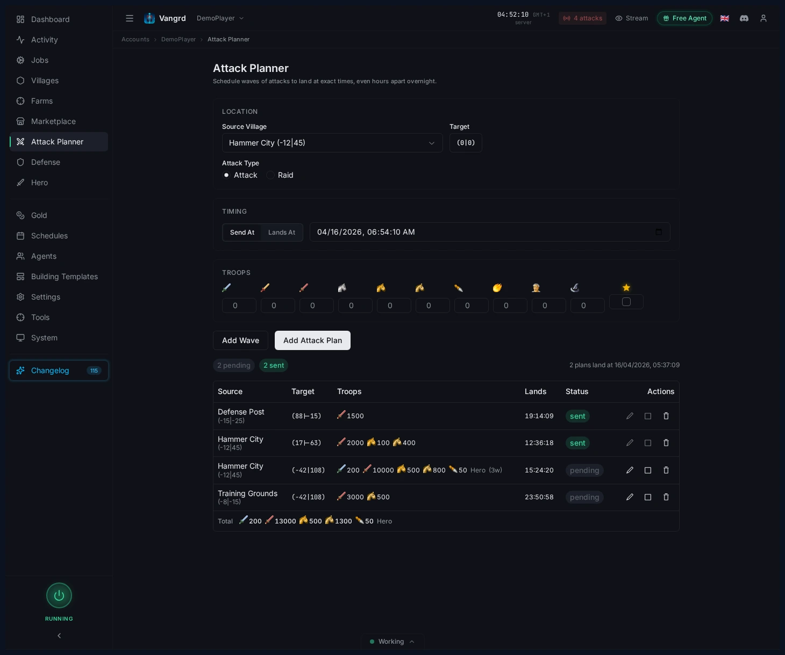
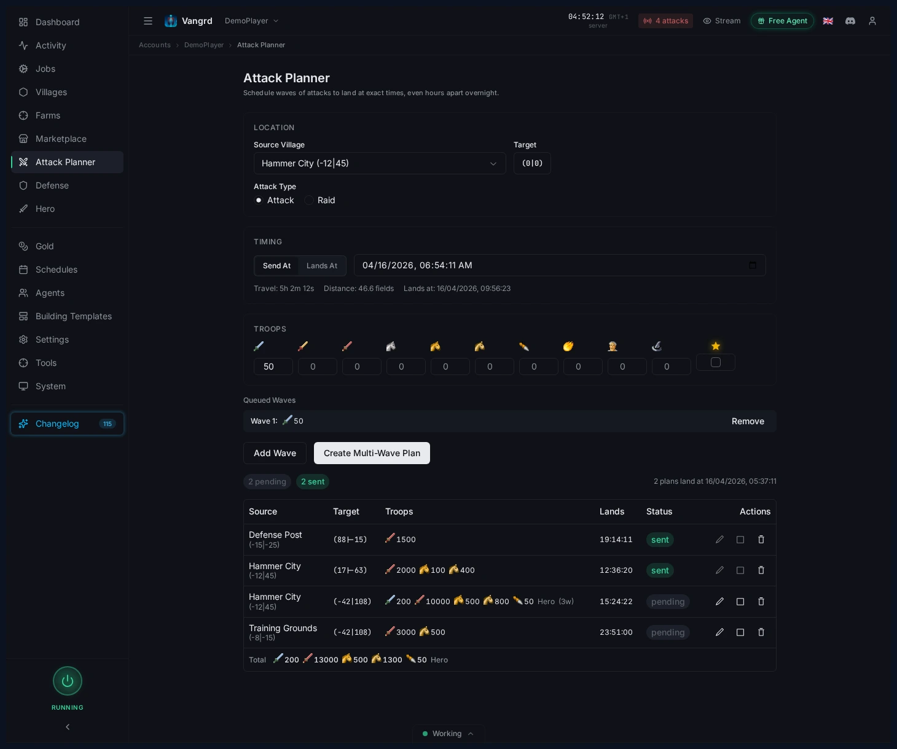

# Travian Attack Planner: Schedule Coordinated Multi-Wave Attacks

Pick a source village, set Send At or Lands At timing, queue waves, and manage pending attack plans in Vangrd.

The live version of this guide is at [vangrd.bot/guides/attack-planner](https://vangrd.bot/guides/attack-planner). Last updated 2026-04-16.

## Build the plan from source, target, and timing

Set up source, target, timing, and troops in a single form.

- Pick your `Source Village`.
- Set target coordinates with the coordinate picker.
- Choose `Attack Type` before adding waves.
- Use `Send At` for fixed departure or `Lands At` for coordinated arrivals.
- Check the travel preview before saving.

## Queue multiple waves

Stack waves with different troop compositions for a single target.

- Enter troop counts, then click `Add Wave`.
- Assign the hero to only one wave.
- Add catapult targets or scout details when needed.
- Click `Create Multi-Wave Plan` when the queue looks right.

> **Tip:** Use `Lands At` when waves from several villages must land together.

## Review pending plans in the table

Saved plans stay visible in the planner table until executed.

- Check `Source`, `Target`, `Troops`, `Lands`, and `Status` before the send window.
- Expand a row to inspect individual waves.
- Edit, abort, or delete plans directly from the table.

## Use the planner for coordination, not guesswork

Let the planner handle timing math so you focus on strategy.

1. Prepare each source village separately.
2. Use `Lands At` to synchronize arrival times.
3. Confirm the grouped plan table after saving.
4. Execute hands-free at send time.

For protection on the receiving end, use the [Automated Defense guide](https://vangrd.bot/guides/automated-defense). For scouting and raid pressure around the same targets, see [Farm List Automation](https://vangrd.bot/guides/travian-farm-bot).
