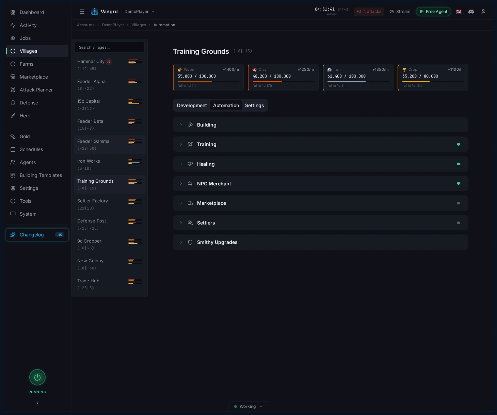
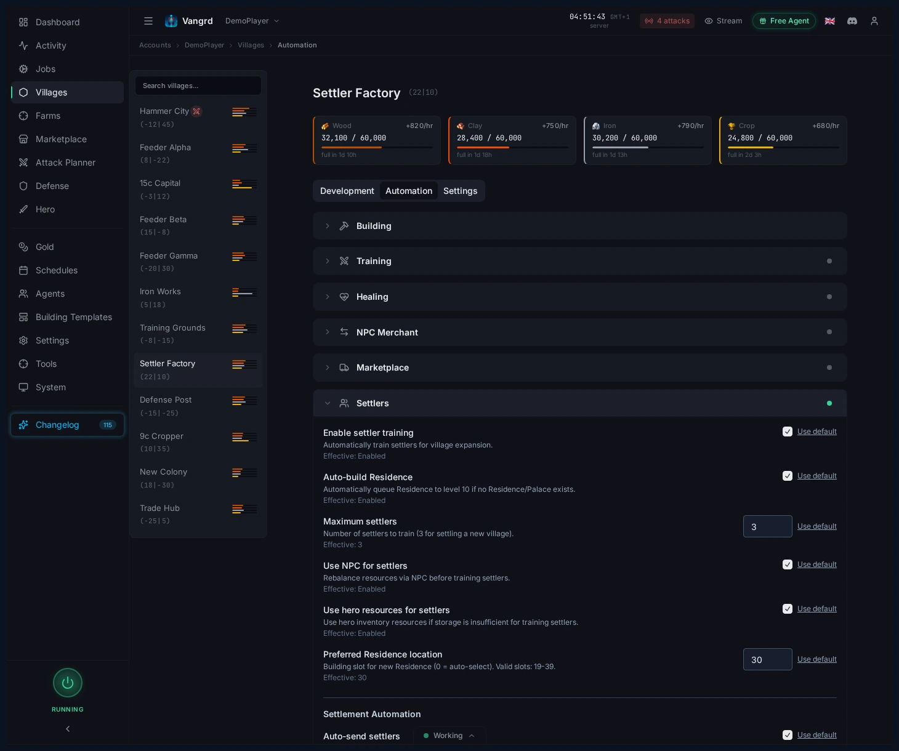

# Travian Settler Bot: Auto-Train Settlers and Found New Villages

Configure settler training, Residence support, and settlement coordinates in Vangrd's village automation.

The live version of this guide is at [vangrd.bot/guides/auto-expansion](https://vangrd.bot/guides/auto-expansion). Last updated 2026-04-16.

## Open expansion from Village Automation

Configure settler training and settlement from the Village Automation page.

## Configure settler training

Open the `Settlers` section to set up your expansion.

- `Enable settler training` — turns on settler production for the village.
- `Auto-build Residence` — builds the Residence automatically if missing.
- `Maximum settlers` — how many settlers to train before pausing.
- `Use NPC for settlers` / `Use hero resources for settlers` — spend extra resources to train faster.
- `Preferred Residence location` — locks the building slot in your build plan.

> **Tip:** Lock the Residence slot early so template application and settler prep do not fight each other later.

## Turn on settlement automation

The `Settlement Automation` section controls when settlers depart.

- `Auto-send settlers` — dispatches settlers once the required count is ready.
- Enter target coordinates before settlers finish training.
- Leave auto-send off if you only want the village to stockpile settlers for manual use.

## Keep the pipeline simple

1. Build or reserve the Residence.
2. Train settlers with the resource helpers you trust.
3. Set the destination coordinates.
4. Enable auto-send only when the target village slot is confirmed.

For queue prep around Residence timing, see the [Building Queue guide](https://vangrd.bot/guides/building-queue-automation). New users should start with [Getting Started](https://vangrd.bot/guides/getting-started).
