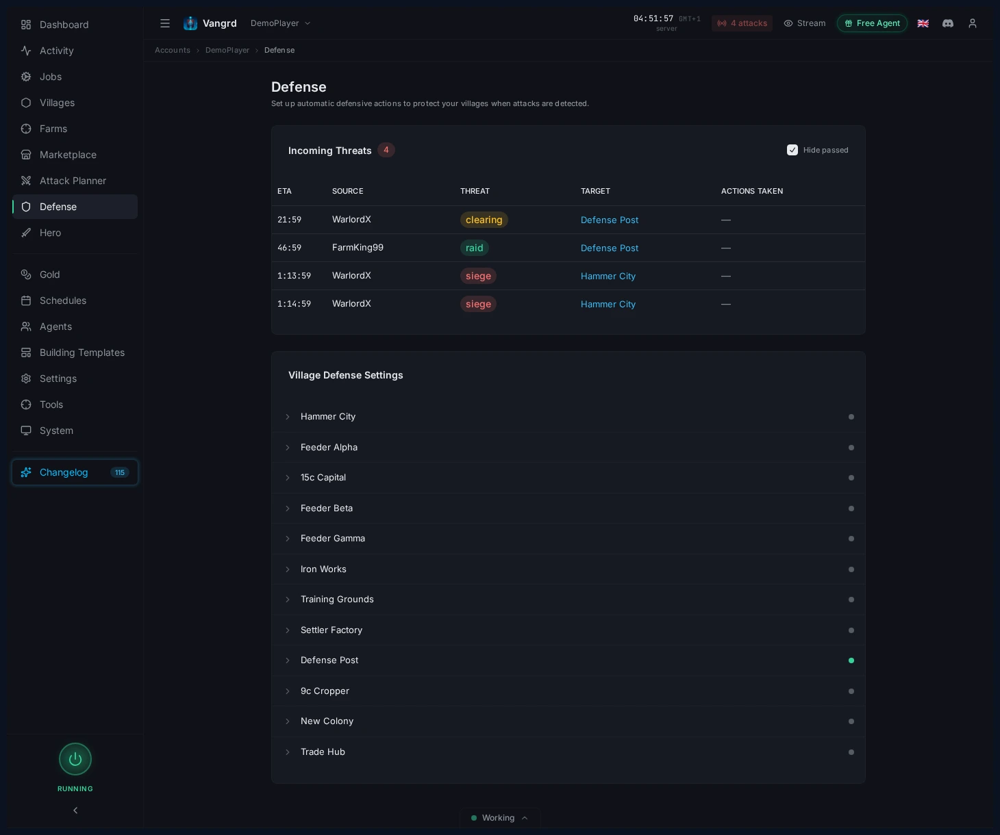
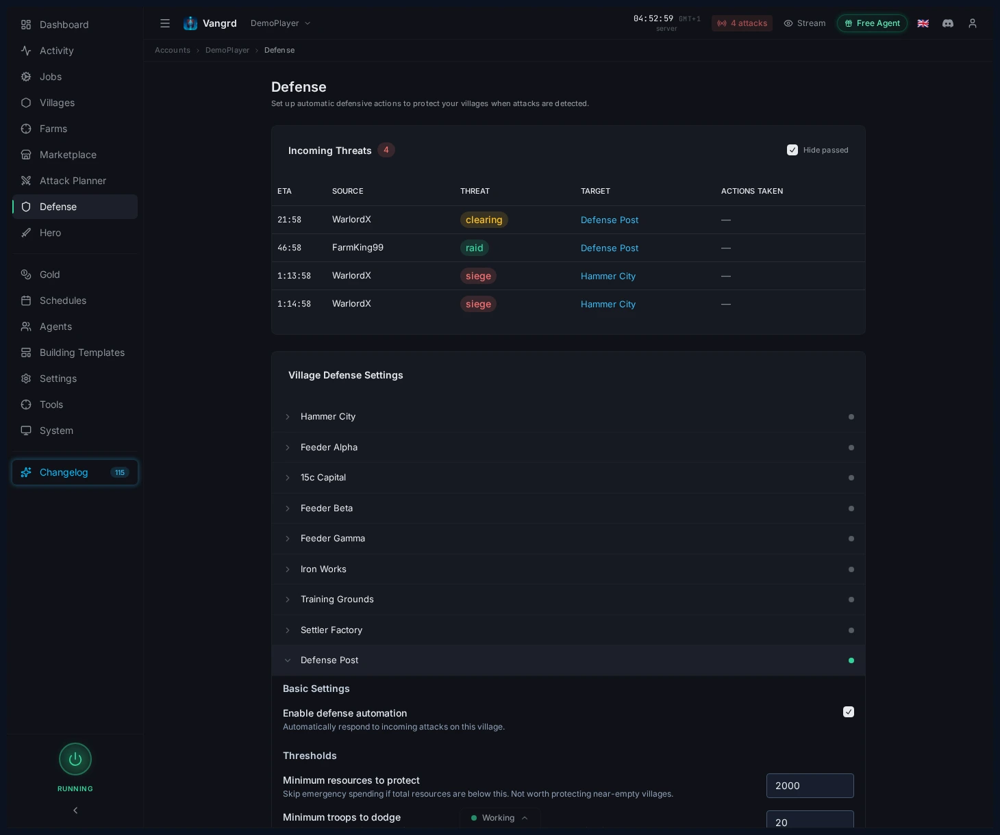

# Travian Defense Bot: Attack Alerts and Village Response Rules

Watch incoming attacks, configure per-village responses, and wire notifications from Vangrd's defense automation.

The live version of this guide is at [vangrd.bot/guides/automated-defense](https://vangrd.bot/guides/automated-defense). Last updated 2026-04-16.

## See every incoming on the Defense page

The Defense view lists every threat across your account in one place.

- Check which village is hit next at a glance.
- Triage from this table when multiple villages are threatened.
- Expand a village to change its response rules.

## Expand a village to define responses

Each village has its own defense rules.

- `Enable defense automation` toggles automation for the village.
- `Minimum resources to protect` skips nearly empty villages.
- `Minimum troops to dodge` ignores stacks too small to bother moving.
- `Threat Responses` splits behavior by attack type.
- `Notifications` controls when alerts fire outside the app.

## Set different actions per threat

The response model is per threat level, not one-size-fits-all.

- Keep `Raid` rules light when the village is expendable.
- Escalate `Clearing`, `Siege`, and `Chiefing` responses for villages that matter.
- Assign separate actions for spending resources, dodging troops, and sending notifications.

> **Tip:** Protect capitals and hammers aggressively. Feeders rarely need more than basic raid rules.

## Watch the dashboard alert

The dashboard shows incoming attack counts before you open Defense.

- Use the alert as a quick signal that something needs attention.
- Jump into Defense from there when the count changes.

## Wire notifications carefully

- Enable notifications only on villages where the threat matters.
- Raise `Minimum threat level` on low-value villages to cut noise.
- Turn on `Notify on actions` when you need confirmation that dodges or spend-down rules fired.

For schedule tuning around ownership and activity windows, pair this with the [Schedules and Safety guide](https://vangrd.bot/guides/schedules-and-safety). For first-time account setup, start with [Getting Started](https://vangrd.bot/guides/getting-started).
