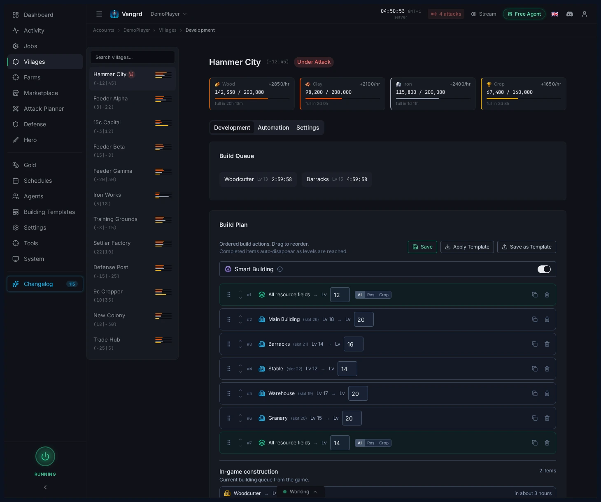
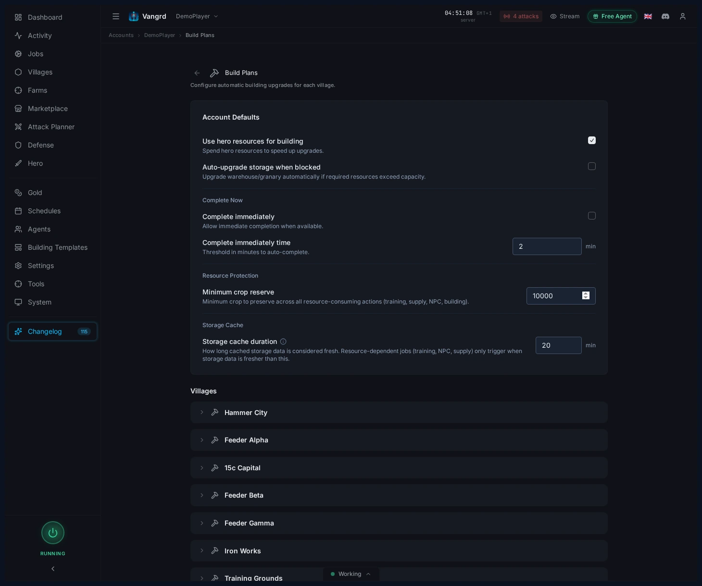
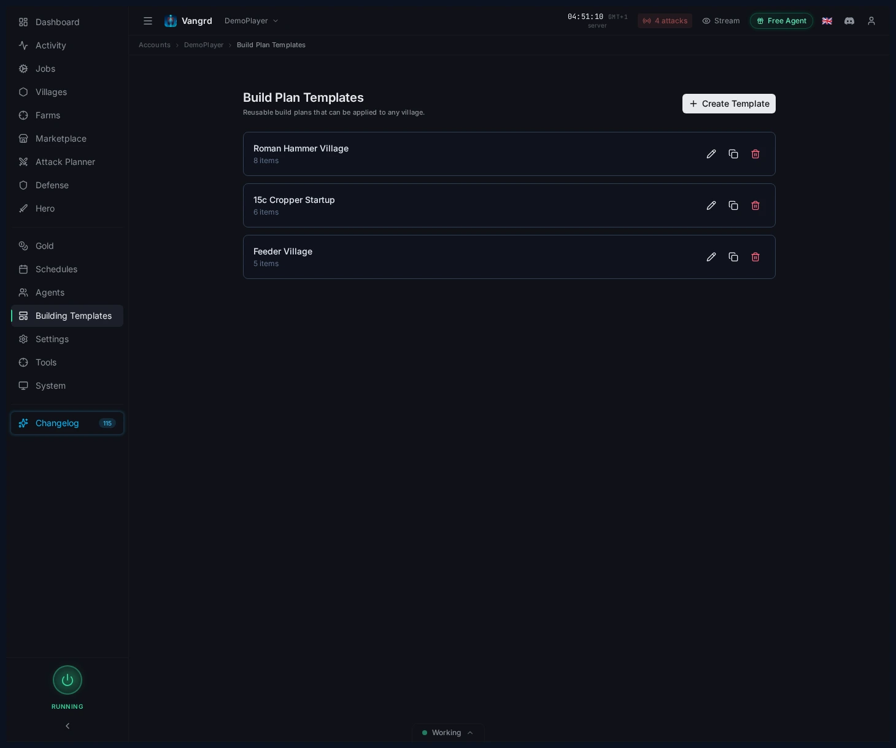
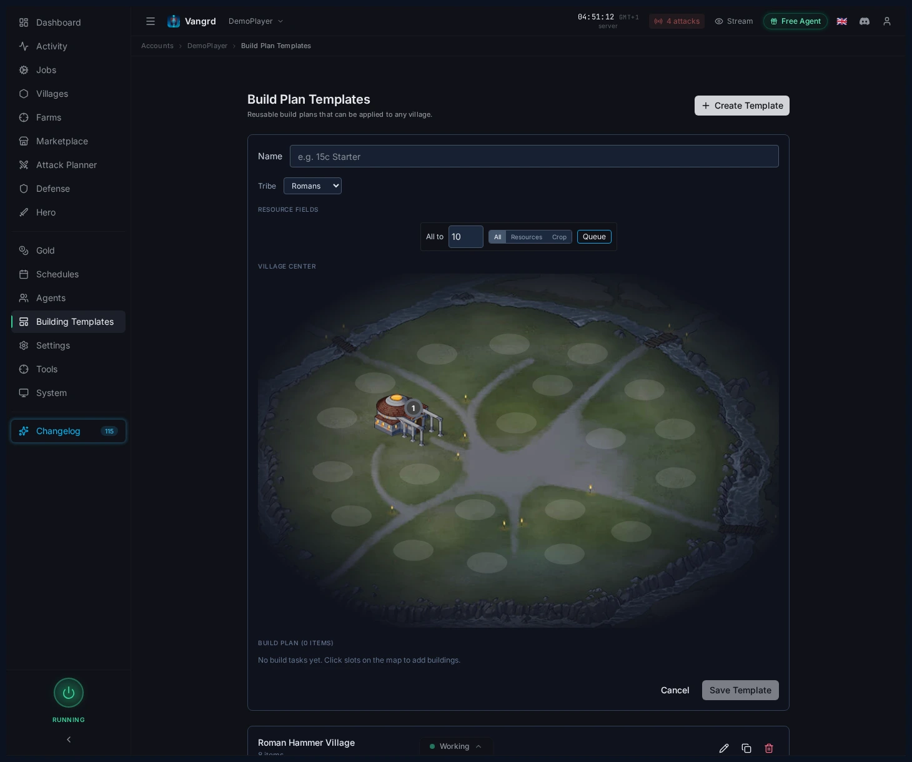
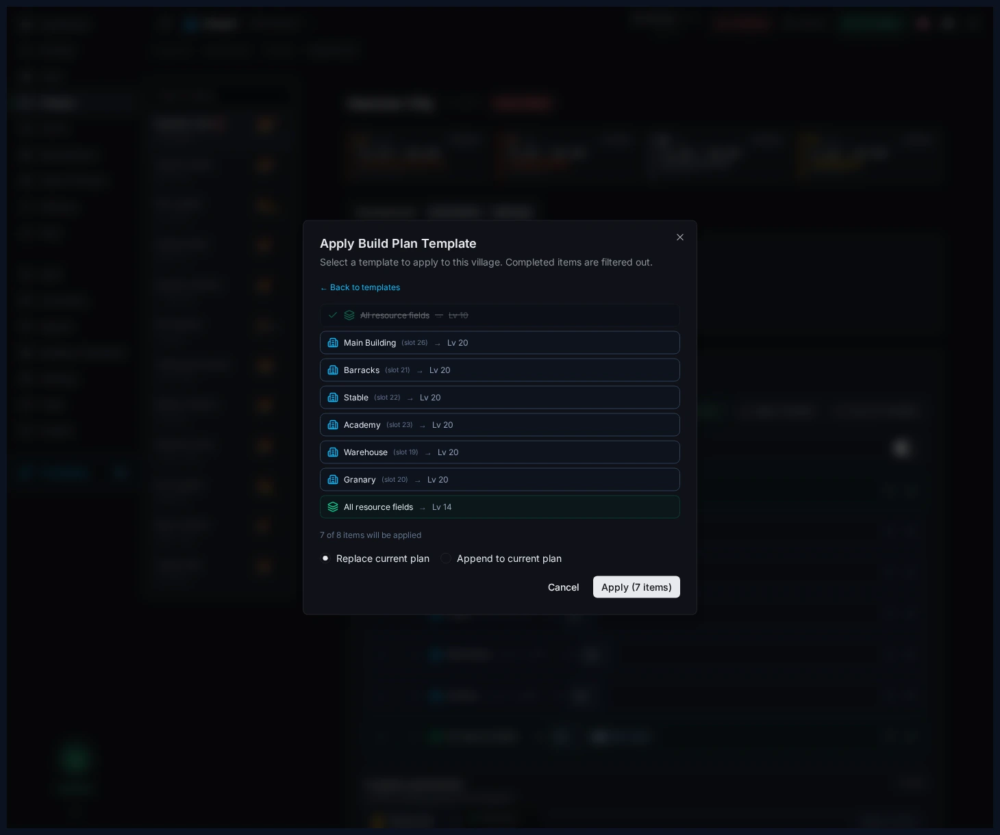

# Travian Auto Builder: Automate Building Queues and Upgrades

Set village build plans, account defaults, reusable templates, and template application in Vangrd's building automation.

The live version of this guide is at [vangrd.bot/guides/building-queue-automation](https://vangrd.bot/guides/building-queue-automation). Last updated 2026-04-16.

## Build plans live on Village Development

Manage each village's build queue under `Villages > Development`.

- `Build Plan` — the ordered list Vangrd works through for that village.
- `Demolish Plan` — separate list for teardown jobs.
- Reorder, duplicate, and remove entries directly from the village plan.

## Use the village map to place targets

Click slots on the village map to seed or adjust a plan fast.

- Add specific buildings from the map when shaping a new village.
- Use field targets for broad resource-field progression without listing every slot.
- Check queued targets against the live layout before saving a template.

> **Tip:** Keep one clean starter plan per village type and copy it instead of rebuilding from scratch.

## Set account defaults on Build Plans

Configure shared build behavior on the `Build Plans` page.

- `Smart Building` — lets cheaper ready items continue while expensive upgrades wait.
- `Use hero resources` — draws from the hero inventory for build jobs.
- `Special upgrade` — toggles the extra upgrade path when supported.
- `Auto-upgrade storage` — prevents queues from stalling on warehouse or granary caps.
- `Complete immediately` — defines when gold can finish long upgrades.
- `Minimum crop reserve` — protects the crop needed for upkeep.

## Manage reusable templates

Save openers and village archetypes under `Build Plan Templates`.

- Create templates from scratch or from an existing village.
- Keep separate templates for capitals, feeders, hammers, and settlers.
- Duplicate and edit variants for slight differences between village types.

## Edit and apply templates

Edit templates with the map UI, then push them into village plans through a preview dialog.

- Pick the tribe before laying out buildings.
- Use bulk field actions to set a target baseline fast.
- `Apply Template` previews the result and lets you `Replace` or `Append` the destination plan.

For village economy support, pair this with the [Resource Supply guide](https://vangrd.bot/guides/travian-npc-bot). For first-time setup, start with [Getting Started](https://vangrd.bot/guides/getting-started).
