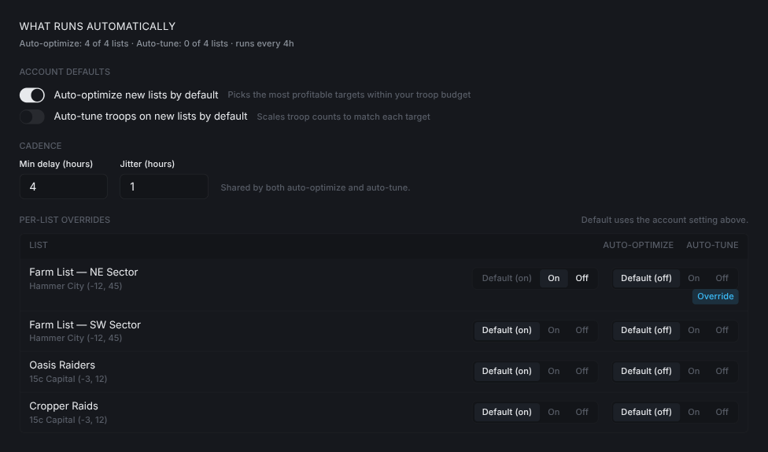
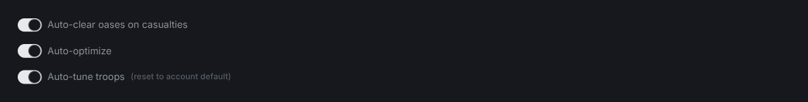
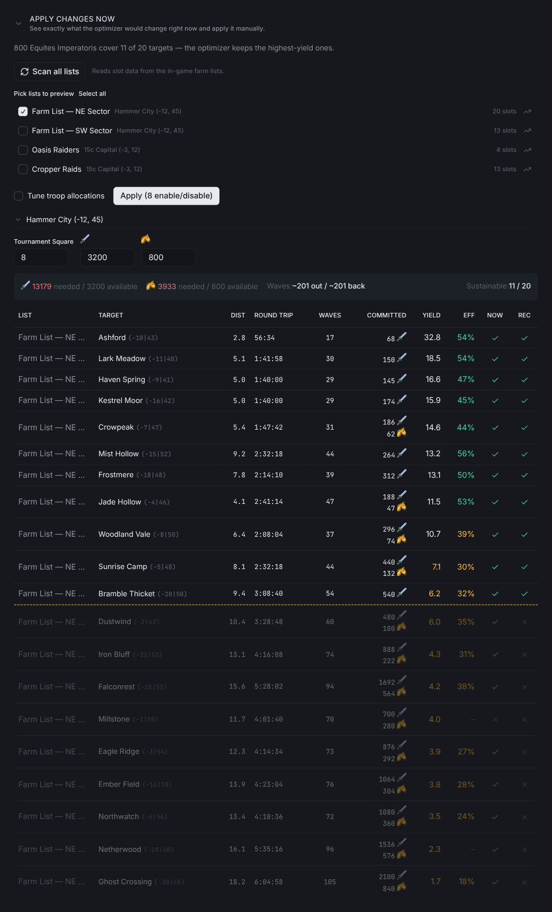
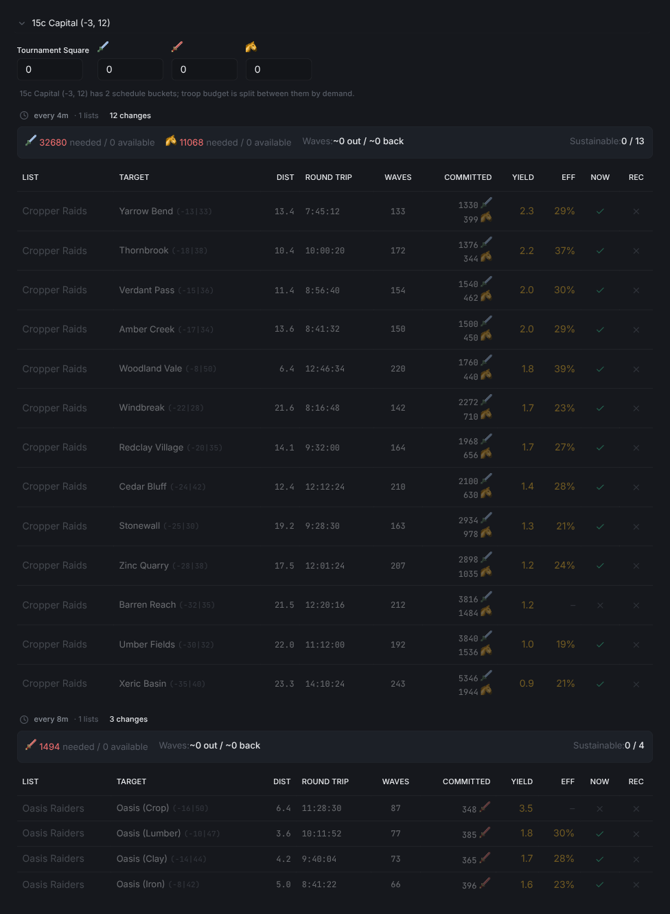

# Travian Farm List Optimizer: Maximize Yield Per Wave

Turn on auto-optimize and auto-tune per list, set cadence, and preview exact changes before they apply — all in one panel.

The live version of this guide is at [vangrd.bot/guides/farm-optimizer](https://vangrd.bot/guides/farm-optimizer). Last updated 2026-04-24.

## Open the optimizer

Click `Optimize farm lists` at the top of `Farms > Farm Lists`. The panel has two sections: one for what runs on its own, one for previewing changes right now.

## Set what runs automatically

The top section controls auto-optimize and auto-tune across your account and per list.

- `Auto-optimize new lists by default` picks the best-yielding targets within your troop budget.
- `Auto-tune troops on new lists by default` changes how many troops each target gets so waves line up with what the target is worth.
- The two switches are independent. You can have one on and the other off.

## Pick a cadence

`Min delay (hours)` and `Jitter (hours)` set how often the jobs run. Both auto-optimize and auto-tune share the same cadence.

- `Min delay` is the shortest gap between runs.
- `Jitter` adds randomness so runs don't fire at exact intervals.

## Override one list at a time

Each list has its own pill for auto-optimize and auto-tune: `Default` / `On` / `Off`.

- `Default` follows the account switch above.
- `On` or `Off` overrides just that list. An `Override` badge appears under the pill.
- Use this when one list should always run untouched, or another should re-tune more aggressively than the rest.

## Flip overrides from the list row

You can also set overrides on the expanded list row under `Farms > Farm Lists`.

- Each switch shows the effective state: its own override, or the account default.
- `(reset to account default)` appears once you've flipped a switch. Click it to drop the override.

## Apply changes now

Expand `Apply changes now` to see exactly what the optimizer would do right now and push it out manually. Leave the section collapsed if you only want the jobs to handle it.

- `Scan all lists` reads fresh slot data from the game.
- Tick the lists you want to preview. `Select all` ticks every scanned list.
- Set the real `Tournament Square` level and troop counts for each village. The summary bar turns red when demand is over budget.
- `Tune troop allocations` tunes troop counts as part of the same apply.
- `Apply` shows how many targets it will enable, disable, and tune before sending anything.
- `YIELD` ranks targets by resources per troop sent. `COMMITTED` is how many troops each target needs while waves are in flight. `NOW` is the current in-game state; `REC` is what it will be after you apply. The dashed line marks where the village runs out of troops.

## Split a village across schedule buckets

When a village has lists on different schedules, the optimizer splits its troop budget between them.

- Lists in one village with different schedules become separate buckets.
- The faster bucket gets more troops per target because it runs more often.
- Each bucket gets its own table. Look for the `{village} has N schedule buckets` note at the top.

> **Tip:** Flip auto-tune to `On` for a single hammer list first to see how tuning changes its slots before turning it on everywhere.

For list setup and schedules, see the [Farm Lists guide](https://vangrd.bot/guides/travian-farm-bot). New accounts should start with [Getting Started](https://vangrd.bot/guides/getting-started).
