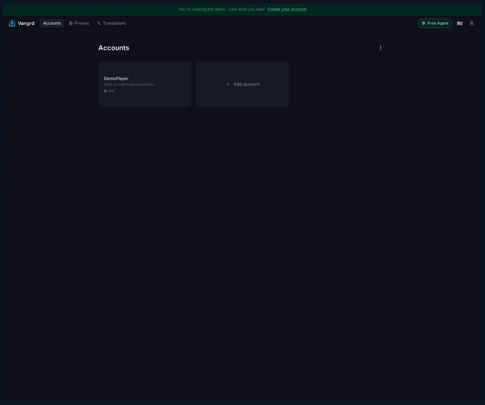
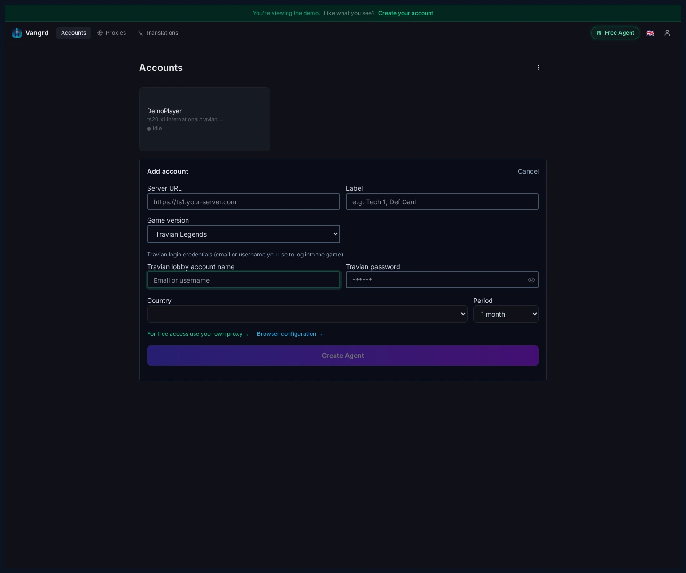
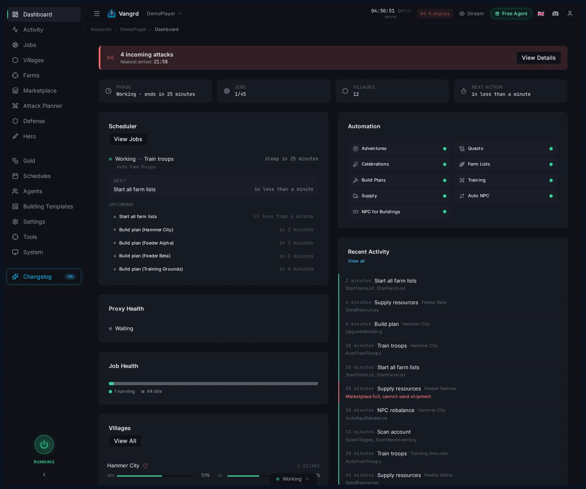

# Getting Started with Vangrd: Connect an Account and Launch Automation

Add your Travian account, review the dashboard, and turn on your first build, farm, and training automations in Vangrd.

The live version of this guide is at [vangrd.bot/guides/getting-started](https://vangrd.bot/guides/getting-started). Last updated 2026-04-16.

## Add your first account

Open **Accounts** and click **Add Account** to connect a Travian server.

## Fill the account form

Enter your server URL, credentials, game version, and agent settings in one dialog.

- `Country` + `Period` configure the agent's dedicated residential IP location and billing period.
- `Label` names the account in the sidebar — use the role, not just the server name.

## Check the dashboard first

Before enabling anything, confirm the scheduler is running and the account connected cleanly.

- Resolve any warning banners first.
- Use the dashboard cards to spot empty queues, storage pressure, or incoming attacks.

## Turn on your first automations

Four pages cover most of what you need:

- **Villages > Development** — build plans, field targets, templates.
- **Farms > Farm Lists** — raid schedules, target scans, oasis clearing.
- **Villages > Automation** — troop training, healing, settler settings.
- **Automation > Supply / Auto NPC** — economy routing and resource balancing.

## Build from one safe loop

A solid first pass is simple:

1. Set a build plan for your main village.
2. Create or import one farm list and scan its targets.
3. Enable troop training on the village that feeds that list.
4. Add supply or NPC only after the first three are stable.

For the next steps, use the [Building Queue guide](https://vangrd.bot/guides/building-queue-automation), [Farm List guide](https://vangrd.bot/guides/travian-farm-bot), and [Troop Training guide](https://vangrd.bot/guides/troop-training-automation).
