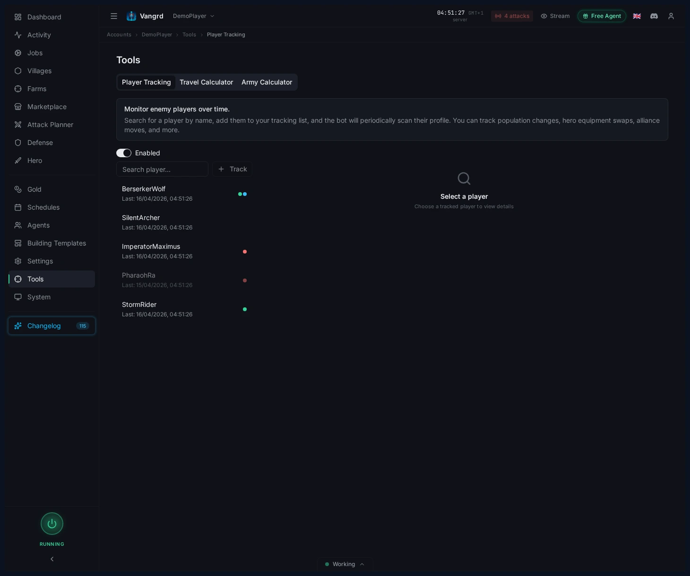
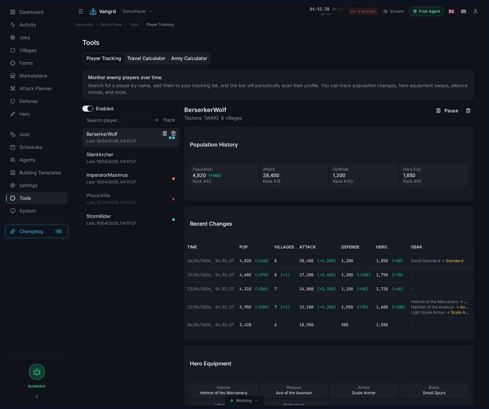
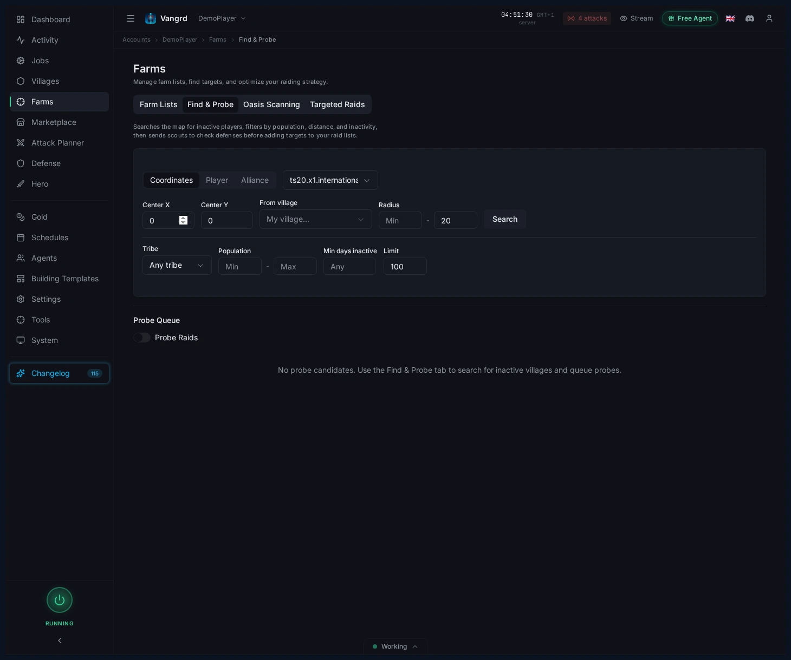

# Travian Player Tracker: Watch Players and Find Inactives

Track player snapshots, review profile changes, and search for nearby inactive villages with Vangrd's intelligence tools.

The live version of this guide is at [vangrd.bot/guides/player-tracking](https://vangrd.bot/guides/player-tracking). Last updated 2026-04-16.

## Track watched players from one panel

Add rivals, nearby threats, and chiefing targets to a single watch list in `Tools > Player Tracking`.

- Tag players with custom labels for fast filtering.
- Select any player to inspect their full snapshot history.

## Review a player's current snapshot

Select a player to see stat cards, recent changes, and hero equipment at a glance.

- Watch `Population`, `Attack`, `Defense`, and `Hero exp` for sudden shifts.
- Check village count and recent changes before writing a player off as inactive.
- Spot hero weapon or gear swaps early.

> **Tip:** A flat population line paired with fresh hero gear matters more than rank.

## Search nearby villages with Find and Probe

Search the map for inactive players and scouting targets with `Find & Probe`.

- Search by `coordinates`, `player`, or `alliance`.
- Filter by radius, tribe, population, and inactivity.
- Build a focused shortlist of villages worth scouting.

## Queue probes and promote good targets

- Send promising villages into the probe queue.
- Review the queue before sending scouts.
- Promote safe targets directly into your raid flow.

For automated raiding after scouting, continue with the [Farm List Automation guide](https://vangrd.bot/guides/travian-farm-bot). New users should start with [Getting Started](https://vangrd.bot/guides/getting-started).
