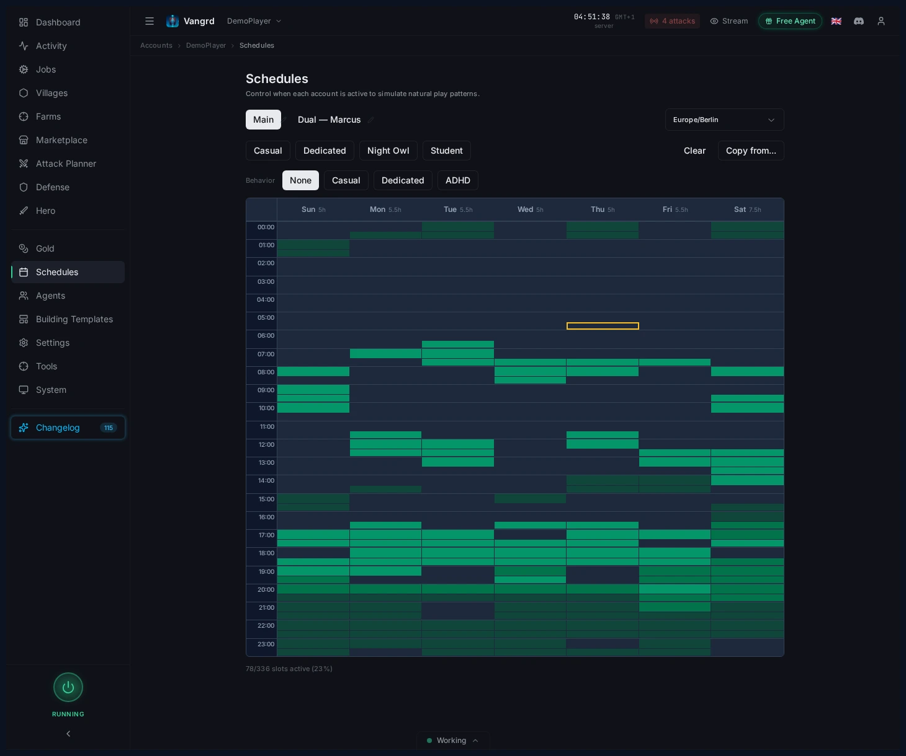
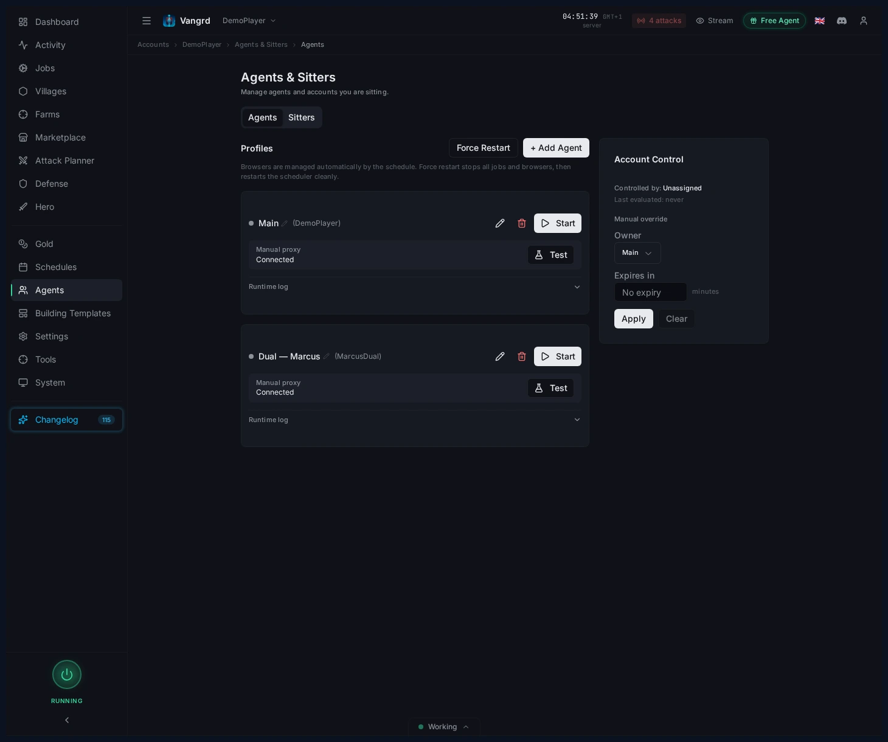

# Travian Bot Schedules: Activity, Agents, and Safety Settings

Set weekly schedules, coordinate agents, and align browser locale, timezone, and randomized browsing settings in Vangrd.

The live version of this guide is at [vangrd.bot/guides/schedules-and-safety](https://vangrd.bot/guides/schedules-and-safety). Last updated 2026-04-16.

## Paint weekly activity windows

Define when each account is allowed to work by painting time slots on a weekly grid.

- Set a timezone before painting slots.
- Use preset buttons to generate a baseline fast.
- `Copy from...` clones a schedule to other personas.
- Check the active-slot summary at the bottom of the grid.

## Add behavior on top of the grid

Layer timing variation onto the grid without redrawing it.

- `Behavior` presets apply common timing profiles in one click.
- `Jitter (min)` offsets exact handoff timing.
- `Skip %` lets a persona randomly miss eligible windows.
- `Early arrival` and `Overstay` soften hard edges around slot boundaries.

> **Tip:** Small jitter and small overstay are usually enough.

## Coordinate agents and handoffs

`Agents & Sitters` lets you see who controls the account and manually intervene in sessions.

- See which agent controls the account.
- Review which agents are on schedule, waiting, or offline.
- Start and stop agent sessions manually.
- Check agent health -- a flaky agent looks a lot like a broken schedule.

## Align browser and automation settings

Configure the browser fingerprint and interaction patterns for each account.

- `Screen size`, `Locale`, and `Timezone` shape the account's browser fingerprint.
- `Game version` keeps automation aligned with the server UI.
- `Mouse movement speed` and `Mouse randomness` control interaction cadence.
- `Random page visits`, `Visit interval`, and `Jitter` add passive browsing between tasks.

For initial account onboarding, use [Getting Started](https://vangrd.bot/guides/getting-started). If you are configuring defense around your schedules, continue with [Automated Defense](https://vangrd.bot/guides/automated-defense).
