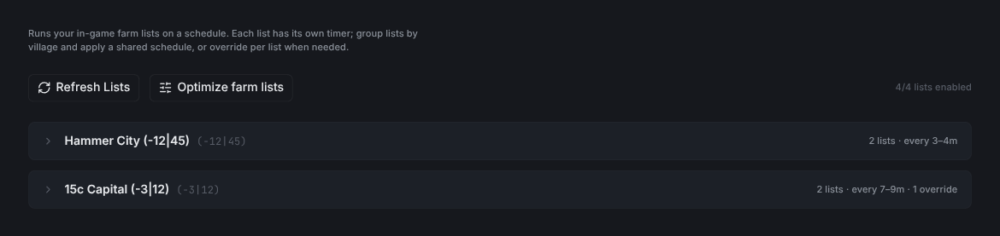
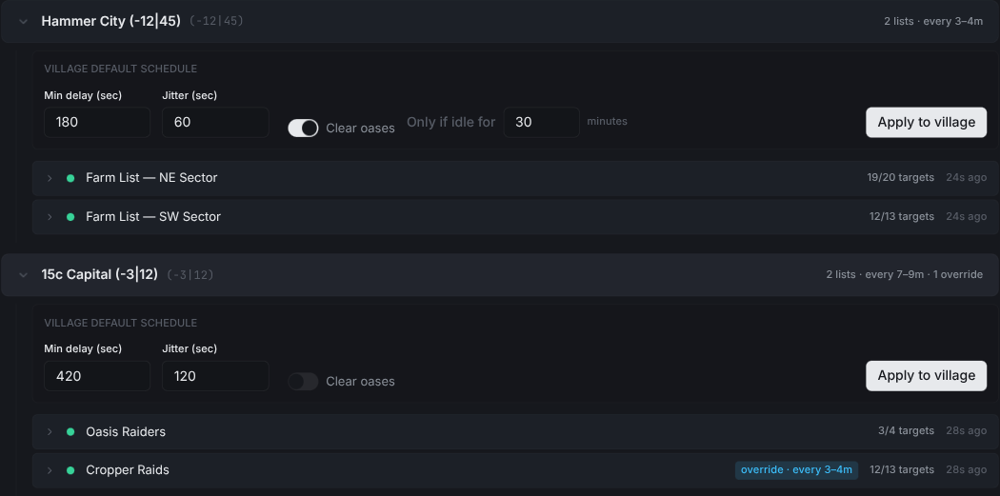
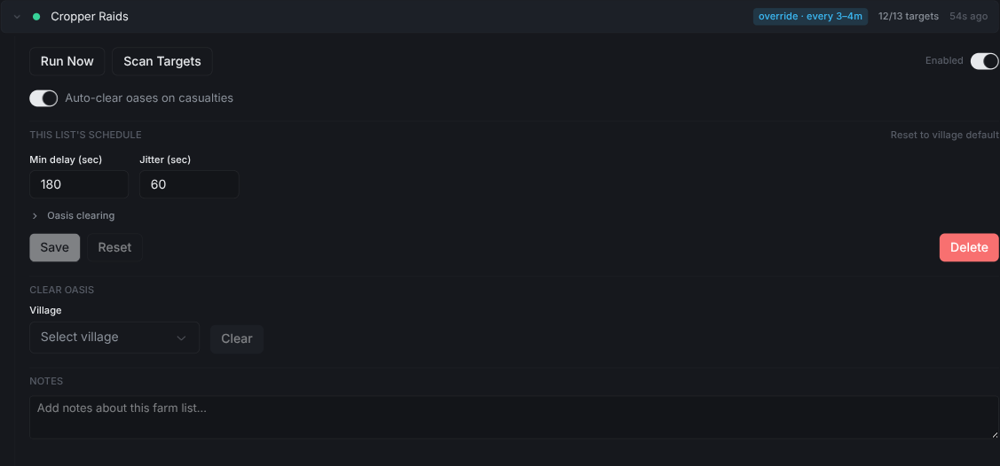
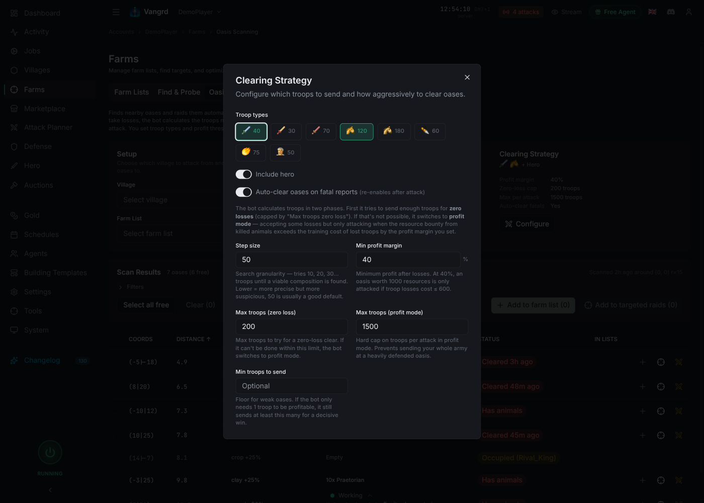
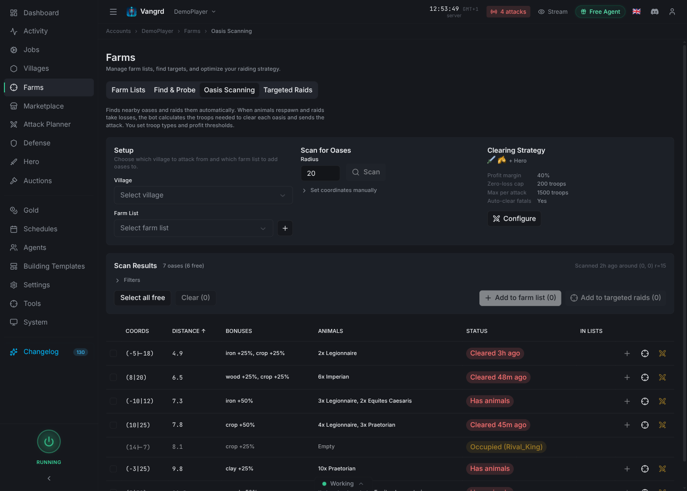

# Travian Farm Bot: Farm Lists, Oasis Farming, and Raid Automation

Schedule Travian farm lists, automate oasis farming and clearing, scan targets, and handle fatal reports with Vangrd.

The live version of this guide is at [vangrd.bot/guides/travian-farm-bot](https://vangrd.bot/guides/travian-farm-bot). Last updated 2026-04-24.

## Group farm lists by village

The Farm Lists panel groups every list by its home village and shows the schedule on the row (for example, `2 lists · every 3–4m`).

- `Refresh Lists` re-reads your farm lists from the game.
- `Optimize farm lists` opens the optimizer.
- The counter on the right shows how many lists are enabled.

## Apply one schedule to every list in a village

Expand a village to set its schedule. Use `Apply to village` to set it on every enabled list at once.

- `Min delay (sec)` is the shortest gap between runs.
- `Jitter (sec)` adds randomness so raids don't fire at exact intervals.
- `Clear oases` turns on auto-clearing before each run. `Only if idle for` skips oases you just cleared.
- `Apply to village` sets this schedule on every enabled list. If any list has its own schedule, a dialog asks first before replacing it.

> **Tip:** Set the village schedule first. Then override only the lists that need something different.

## Override the schedule for a single list

Expand a list to give it its own schedule and actions.

- `Run Now` fires the list right away.
- `Scan Targets` re-reads targets from the game.
- `Auto-clear oases on casualties` clears an oasis again after a fatal report.
- Edit `Min delay` and `Jitter` to override the village schedule. A blue `override · every Nm` tag appears on the collapsed row.
- `Reset to village default` removes the override. `Delete` removes the list's schedule.

## Configure the clearing strategy once per account

Open the Clearing Strategy modal from `Farms > Oasis Scanning > Configure`. These settings apply to every list that clears oases.

- Pick the troop types Vangrd sends to clear. You can `Include hero`.
- `Min profit margin` is the minimum profit over troop cost. Below this, Vangrd won't attack.
- `Max troops (zero loss)` is the troop cap when Vangrd tries to win without losses. `Max troops (profit mode)` is the cap when it takes losses for loot.
- `Auto-clear oases on fatal reports` re-enables the list once the oasis is cleared.

## Scan and add oases in bulk

Open `Farms > Oasis Scanning` to find nearby oases and add them to a list.

- Pick a source village and a destination list. Create one inline with `+`.
- `Scan` reads a radius around the source village. Pick a radius that matches your raid time.
- Filter results by `Cleared`, `Has animals`, or `Occupied`.
- Add one with `+`, or multi-select and use `Add to farm list` for a batch.

To rank targets by yield, continue with the [Farm Optimizer guide](https://vangrd.bot/guides/farm-optimizer). New to the app? Start with the [Getting Started guide](https://vangrd.bot/guides/getting-started).
