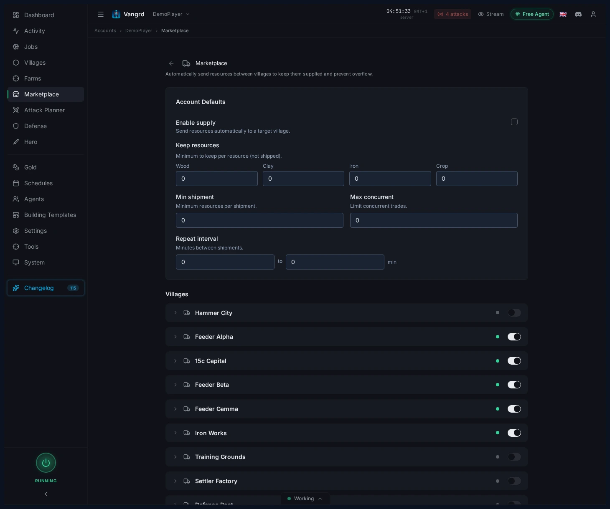
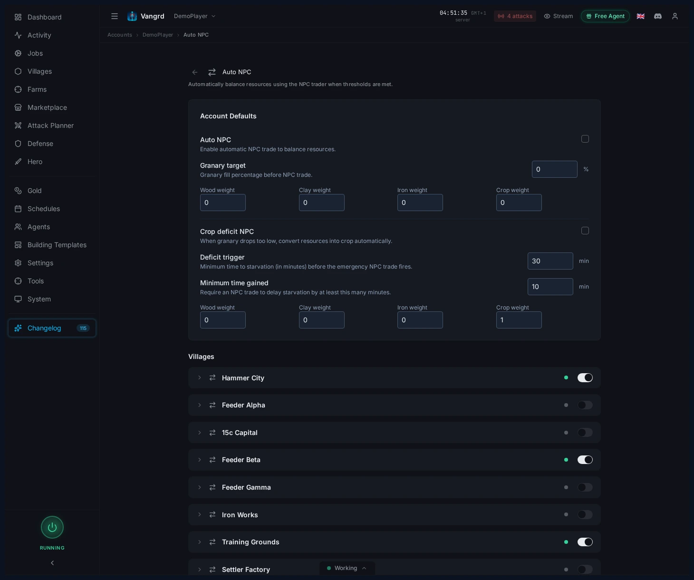
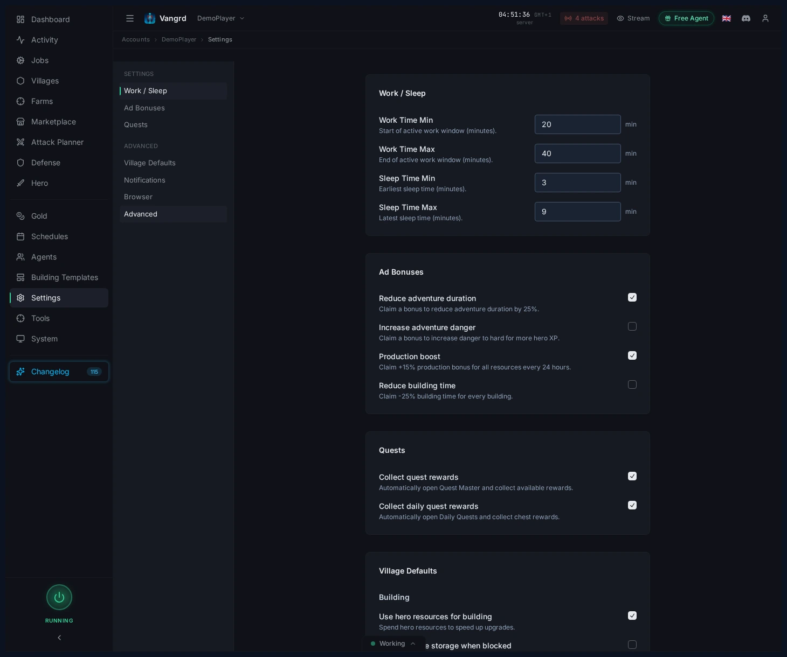

# Travian NPC Bot: Auto NPC Trades and Supply Route Automation

Automate Travian NPC trades, configure village supply routes, and cap account-wide NPC and shipment activity with Vangrd.

The live version of this guide is at [vangrd.bot/guides/travian-npc-bot](https://vangrd.bot/guides/travian-npc-bot). Last updated 2026-04-24.

## Supply routes live on the Supply page

Configure village-to-village shipments on the Supply page.

- `Enable supply` toggles the route for that village.
- `Target village` sets where merchants send surplus.
- `Keep resources` reserves local stock that should never ship out.
- `Min shipment` prevents tiny runs that waste merchants.
- `Max concurrent` caps how many shipments can be in flight.
- `Repeat interval` sets how often the village checks and sends.

## Balance villages on the Auto NPC page

Auto NPC handles two jobs: normal rebalancing and crop emergency handling.

- `Auto NPC` rebalances resources when the village hits the `Granary target`.
- Resource weights control the mix after each NPC trade.
- `Crop deficit NPC` fires when crop upkeep outpaces production.
- `Deficit trigger` sets how close to starvation before it kicks in.
- `Minimum time gained` stops emergency NPC from burning gold on tiny extensions.
- Crop-deficit weights can differ from normal balancing weights.

> **Tip:** Use different weights for normal and crop-deficit NPC -- they solve different problems.

## Cap account-wide activity in Account Settings

The village pages define behavior; the account pages define limits.

- `Use NPC for buildings` lets the build queue trigger NPC trades.
- `NPC max uses per hour` caps gold spend across the whole account.
- `Shipments max per hour` limits merchant traffic to a safe rate.

## Make the economy layers work together

A stable setup works in layers:

1. Feeders hold a local floor via `Keep resources`.
2. Surplus ships to the target village on a repeat interval.
3. The target village runs `Auto NPC` to correct the resource mix.
4. `Crop deficit NPC` catches starvation emergencies only.
5. Keep crop reserves high enough that building and training never starve the village.

For queue support, pair this with the [Building Queue guide](https://vangrd.bot/guides/building-queue-automation). For broader account setup, see [Getting Started](https://vangrd.bot/guides/getting-started).
