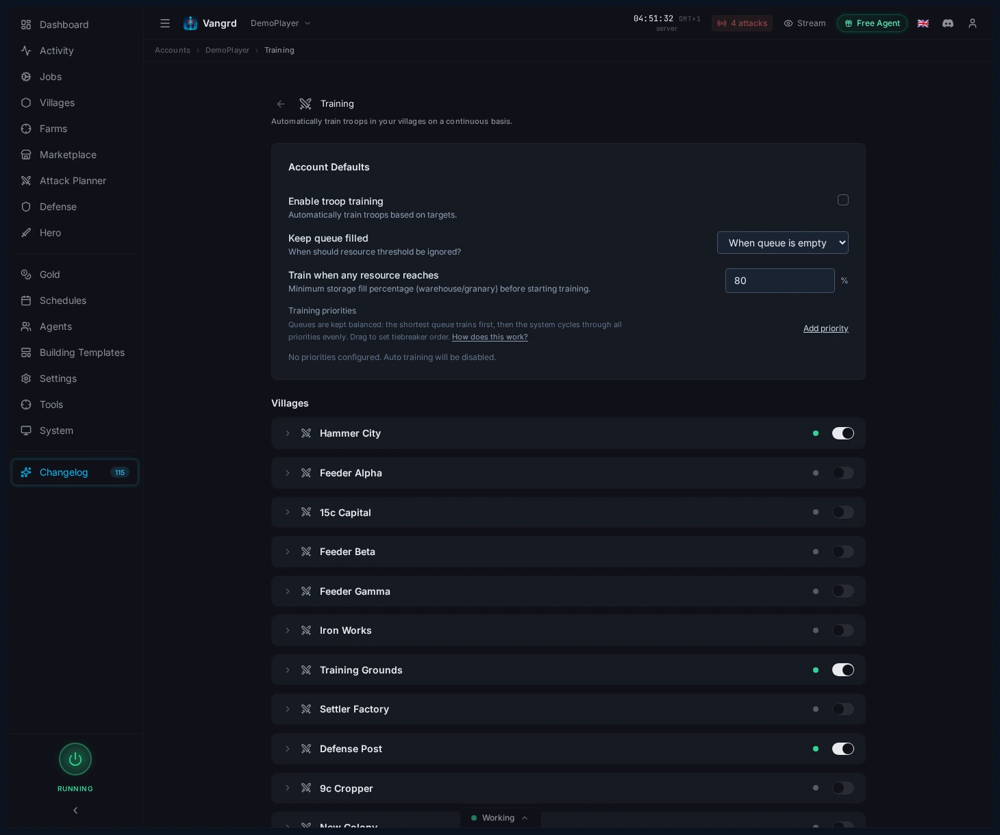
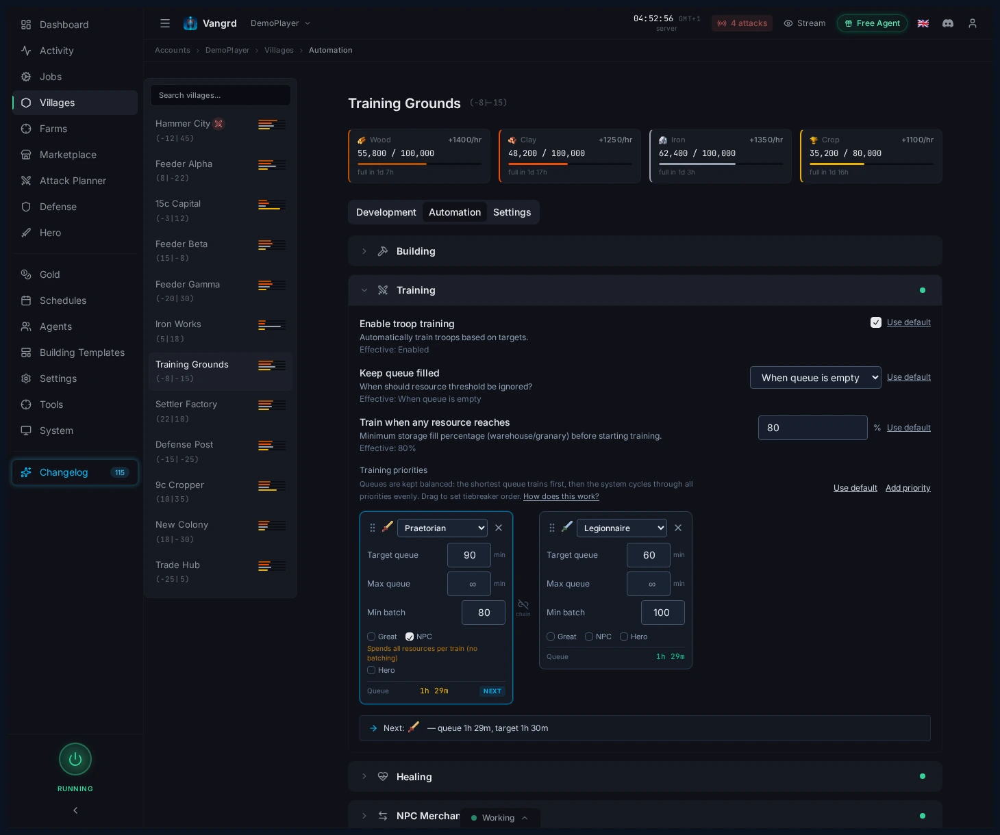
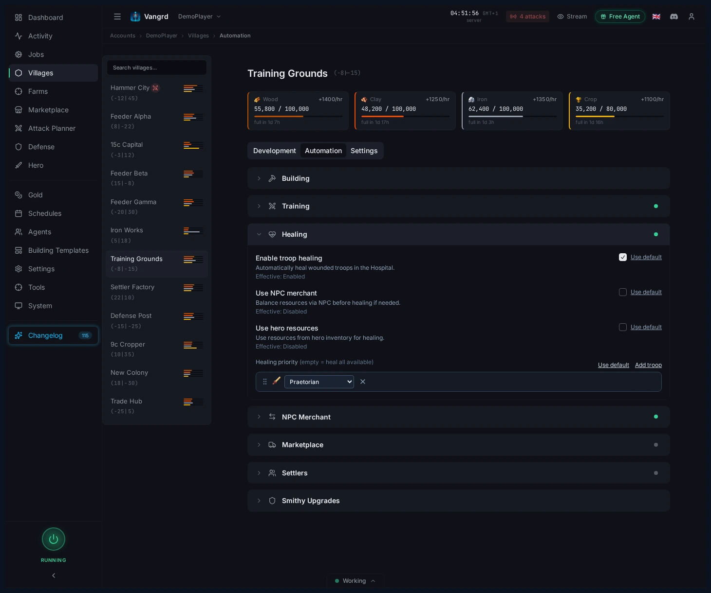

# Travian Troop Training Bot: Auto-Train Troops with Priority Queues

Set account defaults, build village training priorities, and automate troop healing in Vangrd's training automation.

The live version of this guide is at [vangrd.bot/guides/troop-training-automation](https://vangrd.bot/guides/troop-training-automation). Last updated 2026-04-16.

## Start with account defaults

Set your baseline training rules on the account-level Training page.

- `Enable troop training` turns auto-training on or off.
- `Keep queue filled` lets training ignore the resource threshold to keep barracks busy.
- `Train when any resource reaches` sets the storage percentage that triggers training.
- Set sensible account defaults, then override only villages that need different rules.

## Build village-specific queues on Automation

Configure per-village training priorities under `Villages > Automation`.

- Drag priorities to control which troop trains first when multiple queues compete.
- `Target queue`, `Max queue`, and `Min batch` control how aggressively each troop line trains.
- `Great`, `NPC`, and `Hero` toggles are per priority, not per village.
- Chain priorities so one troop type always pulls another behind it.

> **Tip:** Give hammer villages short, explicit queues -- they are easier to debug than mixed priorities with vague targets.

## Decide when NPC and hero resources are allowed

Toggle NPC and hero resource usage per training priority.

- Enable `NPC` on priorities that should spend aggressively to keep barracks running.
- Enable `Hero` only where hero resources are worth converting into troops.
- Leave feeder queues on storage thresholds alone when you do not want them burning gold.

## Heal wounded troops from the same area

Troop healing lives in the same village automation flow as training.

- `Enable troop healing` turns on hospital recovery.
- `Use NPC merchant` rebalances resources before healing starts.
- `Use hero resources` lets hospital recovery draw from the hero inventory.
- `Healing priority` controls which troops recover first when resources are tight.

For build support behind training, use the [Building Queue guide](https://vangrd.bot/guides/building-queue-automation). For feeder routing and NPC policy, pair this with the [Resource Supply guide](https://vangrd.bot/guides/travian-npc-bot).
